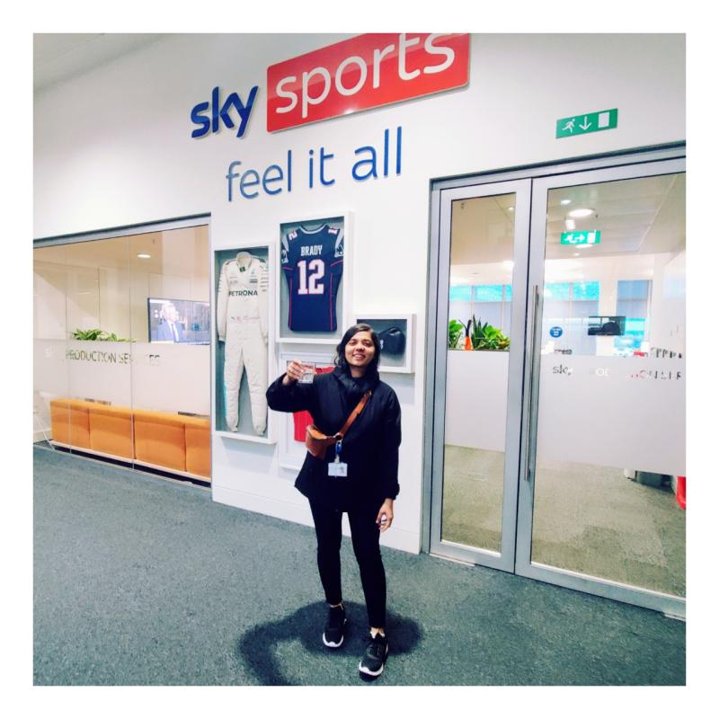

# 👋 Hi, I'm Kannupriya 

**Engineering Leader & Scala Developer | AI Educator & Community Builder | Open Source Mentor**

With over a decade of experience designing scalable backend systems using functional programming, I specialize in building resilient, high-availability platforms with Scala. At Sky, London, I led critical backend development using functional Scala to power large-scale operations.

A passionate contributor to the Scala ecosystem, I co-created **[LLM4S](https://github.com/llm4s/llm4s)**, a Scala-first AI platform, and have actively contributed to projects like **[Scala CLI](https://github.com/VirtusLab/scala-cli)** and **[Scaladex](https://github.com/scalacenter/scaladex)**. I serve as a **Google Summer of Code (GSoC) Org Admin & Mentor (2024, 2025)** with the Scala Center, mentoring contributors and helping grow the next generation of open source developers.  
I also maintain several open source projects, including **[Scaladex](https://github.com/scalacenter/scaladex)**, **[LLM4S](https://github.com/llm4s/llm4s)**, and various initiatives under **[Google Summer of Code](https://github.com/scalacenter/GoogleSummerOfCode?tab=readme-ov-file)**.

I'm also building a global AI community focused on responsible and accessible AI development. I offer AI training and education for developers and teams – bridging the gap between functional programming and practical AI applications.  
Currently collaborating with **Manning Publishing**, I'm developing learning resources to help engineers navigate the future of **Generative AI**.

As a seasoned international speaker, I’ve delivered talks in 8+ countries at events such as **Scala Days**, **Google Open Source Conference**, and **Bay Area Scala Conference**, engaging audiences on AI, functional programming, data engineering, and software design.

### Speaking Highlights

**2023–2025**: 
- Bay Area Scala Conference (USA)
- Scala Days (Switzerland)  
- Art of Scala (Warsaw)  
- ScalaIO (Paris)  
- Functional World (Poland)  
- Google Summer Of Code Mentor Summits (California, Munich)  
- Scala India  
- Scala Workshop (Singapore)
- Dallas Scala Enthusiasts (Texas, USA)
- ...and more

Frequent speaker at:  
- London Scala User Group  
- Scalabridge (London)
- Google Open Source Conferences

I'm committed to **mentoring developers**, **building inclusive communities**, and advancing the global adoption of **Scala**, **open source**, and **ethical AI**.

  

**Cheers to showing up every day, even when it's hard and becoming a little better each time.** ✨  
This photo from my first day at Sky in 2022 is a reminder for me, progress isn’t always loud, but it’s always worth it. 💻🎾  
Grateful for the journey so far, and trust in the universe for the path forward it's creating for me. 💫  

